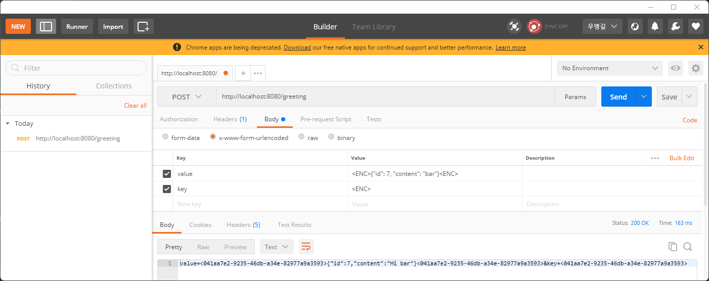

# Body 데이터 암호화하기

* 요청은 아래와 같이 Body 에 value, key 파라미터로 전송된다고 가정합니다.

```
POST /greeting HTTP/1.1
Content-Type: application/x-www-form-urlencoded; charset=UTF-8

value=<ENC>{"id": 1, "content": "bar"}<ENC>&key=<ENC>
```

```
POST /greeting HTTP/1.1
Content-Type: application/x-www-form-urlencoded; charset=UTF-8

value=<FOO>{"id": 1, "content": "bar"}<FOO>&key=<FOO>
```

* 응답은 아래와 같이 Body 에 value, key 파라미터로 전송된다고 가정합니다.

```
HTTP/1.1 200
Content-Type: application/x-www-form-urlencoded

value=<BAR>{"id": 1, "content": "bar"}<BAR>&key=<BAR>
```

* Controller 규격은 아래와 같다고 가정합니다.

[GreetingController](src/main/java/foo/GreetingController.java)

```java
@RestController
public class GreetingController {

    @PostMapping("/greeting")
    public Greeting greeting(@RequestBody Greeting greeting) {
        Greeting responseGreeting = new Greeting();
        responseGreeting.setId(greeting.getId());
        responseGreeting.setContent("Hi " + greeting.getContent());

        return responseGreeting;
    }

}
```

* 더미 구현에서는 key 값 문자열에 해당하는 암호화된 원문을 지우는 것으로 복호화합니다.
* 즉 위의 요청들은 일반적(정상적?)으로 아래 요청과 같습니다.

```http
POST /greeting HTTP/1.1
Content-Type: application/json; charset=UTF-8

{"id": 1, "content": "bar"}
```

`Content-Type` `application/x-www-form-urlencoded` 을 Json message converter 가 지원하기 위해

[WebConfiguration](src/main/java/foo/WebConfiguration.java)

```java
@Configuration
public class WebConfiguration implements WebMvcConfigurer {

    /**
     * EncryptJsonMessageConverter 를 등록합니다.
     *
     * @param converters 기본 설정된 메시지 변환기들.
     */
    @Override
    public void extendMessageConverters(List<HttpMessageConverter<?>> converters) {
        MappingJackson2HttpMessageConverter customConverter = new EncryptJsonMessageConverter();
        // 순서가 중요합니다. 맨 앞쪽에 두지 않으면, 상태에 따라 다른 변환기가 먼저 처리할 수 있습니다.
        converters.add(0, customConverter);
    }

}
```

* 아래와 같이 암호화된 Body 를 암복호화하여 부모 converter 에 진지한 읽기 및 쓰기를 위임하는 형태로 구현합니다.

[EncryptJsonMessageConverter](src/main/java/foo/EncryptJsonMessageConverter.java)

```java
/**
 * 읽기와 쓰기를 가로채고, 실제 진지한 읽기 및 쓰기 구현은 MappingJackson2HttpMessageConverter 기본 구현을 따릅니다.
 * 다른 미디어 형식을 지원합니다.
 *
 * @see MappingJackson2HttpMessageConverter#read(Type, Class, HttpInputMessage)
 * @see MappingJackson2HttpMessageConverter#writeInternal(Object, Type, HttpOutputMessage)
 * @see MappingJackson2HttpMessageConverter#getSupportedMediaTypes()
 */
public class EncryptJsonMessageConverter extends MappingJackson2HttpMessageConverter {

    @Override
    public Object read(Type type, @Nullable Class<?> contextClass, HttpInputMessage inputMessage) throws IOException, HttpMessageNotReadableException {
        if (inputMessage.getBody() == null) {
            return super.read(type, contextClass, inputMessage);
        }

        // 요청 스트림(request body)을 바로 읽으면, 규격이 안 맞기 때문에, 일단 가로챈 다음, 규격에 맞는 요청 스트림의 내용으로 바꿉니다.
        // 암호화된 JSON & 키 --> 평문 JSON
        String decrypted = decrypt();
        HttpInputMessage decryptedMessage = new EncryptHttpInputMessage(inputMessage.getHeaders(), new ByteArrayInputStream(decrypted.getBytes(StandardCharsets.UTF_8)));

        // 읽기 동작을 위임합니다.
        return super.read(type, contextClass, decryptedMessage);
    }

    @Override
    public void writeInternal(Object object, Type type, HttpOutputMessage outputMessage) throws IOException, HttpMessageNotReadableException {
        // 응답 스트림(response body)에 바로 쓰면, 규격이 안 맞고, 쓰기를 직접 구현하는 것은 번거롭기 때문에 쓰는 동작을 가로채기 위한 스트림을 대신 전달합니다.
        ByteArrayOutputStream spy = new ByteArrayOutputStream();
        EncryptHttpOutputMessage interceptor = new EncryptHttpOutputMessage(outputMessage.getHeaders(), spy);

        // 쓰기 동작을 위임합니다.
        super.writeInternal(object, type, interceptor);

        // 가로채어진 내용을 규격에 맞는 내용으로 바꿉니다.
        // 평문 JSON --> 암호화된 JSON & 키
        String origin = new String(spy.toByteArray(), StandardCharsets.UTF_8);
        String encrypted = encrypt(origin);

        // 암호문 & 키를 응답 스트림에 씁니다.
        outputMessage.getBody().write(encrypted.getBytes(StandardCharsets.UTF_8));
        outputMessage.getBody().flush();
    }

    /**
     * 평문 JSON 을 반환합니다.
     *
     * @return 평문 JSON.
     */
    private String decrypt() {
        // 요청 정보를 얻습니다.
        HttpServletRequest request = ((ServletRequestAttributes) RequestContextHolder.getRequestAttributes()).getRequest();
        // 요청 파라미터를 통해 암호화된 JSON 과 키를 얻습니다.
        // application/x-www-form-urlencoded 이기 때문에 요청 파라미터를 통해 이들을 얻을 수 있습니다.
        String value = request.getParameter("value");
        String key = request.getParameter("key");

        return EncryptUtils.decrypt(value, key);
    }

    /**
     * 암호화된 JSON & 키 조합을 반환합니다.
     *
     * @param origin 평문 JSON.
     * @return 암호화된 JSON & 키 조합.
     */
    private String encrypt(String origin) {
        String key = EncryptUtils.generateKey();

        return EncryptUtils.valueAndKey(origin, key);
    }

    /**
     * 기본적으로 application/json 만 처리하기 때문에, application/x-www-form-urlencoded 형식을 추가합니다.
     *
     * @return 지원하는 미디어 형식.
     */
    @Override
    public List<MediaType> getSupportedMediaTypes() {
        List<MediaType> mediaTypes = super.getSupportedMediaTypes();
        List<MediaType> appendedTypes = new ArrayList<>();
        appendedTypes.add(MediaType.APPLICATION_FORM_URLENCODED);
        appendedTypes.addAll(mediaTypes);

        return appendedTypes;
    }

}
```

* ApplicationTest 를 통해 테스트를 수행할 수 있습니다.

[ApplicationTest](src/test/java/foo/ApplicationTest.java)

```java
@SpringBootTest(webEnvironment = SpringBootTest.WebEnvironment.RANDOM_PORT)
public class ApplicationTest {

    @LocalServerPort
    int port;

    ObjectMapper objectMapper = new ObjectMapper();

    @BeforeEach
    void beforeEach() {
        RestAssured.port = port;
    }

    @Test
    void postGreeting() throws Exception {
        Greeting requestGreeting = new Greeting();
        requestGreeting.setId(7);
        requestGreeting.setContent("Foo");

        String json = objectMapper.writeValueAsString(requestGreeting);
        String key = EncryptUtils.generateKey();
        String value = EncryptUtils.encrypt(json, key);

        given().log().all()
                .when().contentType(ContentType.URLENC)
                .formParam("value", value)
                .formParam("key", key)
                .post("/greeting")
                .then().log().all()
                .statusCode(200);
    }

}
```

```
  .   ____          _            __ _ _
 /\\ / ___'_ __ _ _(_)_ __  __ _ \ \ \ \
( ( )\___ | '_ | '_| | '_ \/ _` | \ \ \ \
 \\/  ___)| |_)| | | | | || (_| |  ) ) ) )
  '  |____| .__|_| |_|_| |_\__, | / / / /
 =========|_|==============|___/=/_/_/_/
 :: Spring Boot ::                (v2.7.1)

2023-01-14 09:47:16.696  INFO 24440 --- [    Test worker] foo.ApplicationTest                      : Starting ApplicationTest using Java 1.8.0_311 on LAPTOP-3LP8SRUD with PID 24440 (started by woozo in C:\Users\woozo\git\helloworld\hello-encrypt)
2023-01-14 09:47:16.697  INFO 24440 --- [    Test worker] foo.ApplicationTest                      : No active profile set, falling back to 1 default profile: "default"
2023-01-14 09:47:18.175  INFO 24440 --- [    Test worker] o.s.b.w.embedded.tomcat.TomcatWebServer  : Tomcat initialized with port(s): 0 (http)
2023-01-14 09:47:18.188  INFO 24440 --- [    Test worker] o.apache.catalina.core.StandardService   : Starting service [Tomcat]
2023-01-14 09:47:18.188  INFO 24440 --- [    Test worker] org.apache.catalina.core.StandardEngine  : Starting Servlet engine: [Apache Tomcat/9.0.64]
2023-01-14 09:47:18.350  INFO 24440 --- [    Test worker] o.a.c.c.C.[Tomcat].[localhost].[/]       : Initializing Spring embedded WebApplicationContext
2023-01-14 09:47:18.351  INFO 24440 --- [    Test worker] w.s.c.ServletWebServerApplicationContext : Root WebApplicationContext: initialization completed in 1437 ms
2023-01-14 09:47:19.394  INFO 24440 --- [    Test worker] o.s.b.a.e.web.EndpointLinksResolver      : Exposing 1 endpoint(s) beneath base path '/actuator'
2023-01-14 09:47:21.493  INFO 24440 --- [    Test worker] o.s.b.w.embedded.tomcat.TomcatWebServer  : Tomcat started on port(s): 59237 (http) with context path ''
2023-01-14 09:47:21.504  INFO 24440 --- [    Test worker] foo.ApplicationTest                      : Started ApplicationTest in 5.1 seconds (JVM running for 8.271)

...

Request method:	POST
Request URI:	http://localhost:59237/greeting
Proxy:			<none>
Request params:	<none>
Query params:	<none>
Form params:	value=<eccc86ef-392c-40f6-840f-b387453955e0>{"id":7,"content":"Foo"}<eccc86ef-392c-40f6-840f-b387453955e0>
				key=<eccc86ef-392c-40f6-840f-b387453955e0>
Path params:	<none>
Headers:		Accept=*/*
				Content-Type=application/x-www-form-urlencoded; charset=UTF-8
Cookies:		<none>
Multiparts:		<none>
Body:			<none>
HTTP/1.1 200 
Content-Type: application/x-www-form-urlencoded
Transfer-Encoding: chunked
Date: Sat, 14 Jan 2023 00:47:22 GMT
Keep-Alive: timeout=60
Connection: keep-alive

value=<7d9bb1e5-5e3a-4f7a-9ef0-0ca8f8cff110>{"id":7,"content":"Hi Foo"}<7d9bb1e5-5e3a-4f7a-9ef0-0ca8f8cff110>&key=<7d9bb1e5-5e3a-4f7a-9ef0-0ca8f8cff110>

...

BUILD SUCCESSFUL in 13s

```

* PostMan 에서는 아래와 같이 요청합니다.


